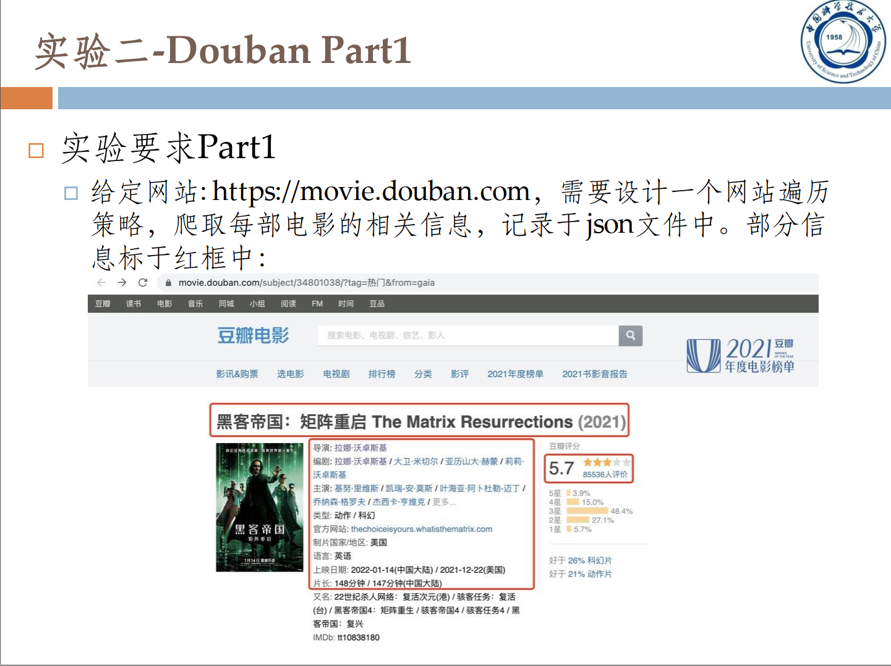
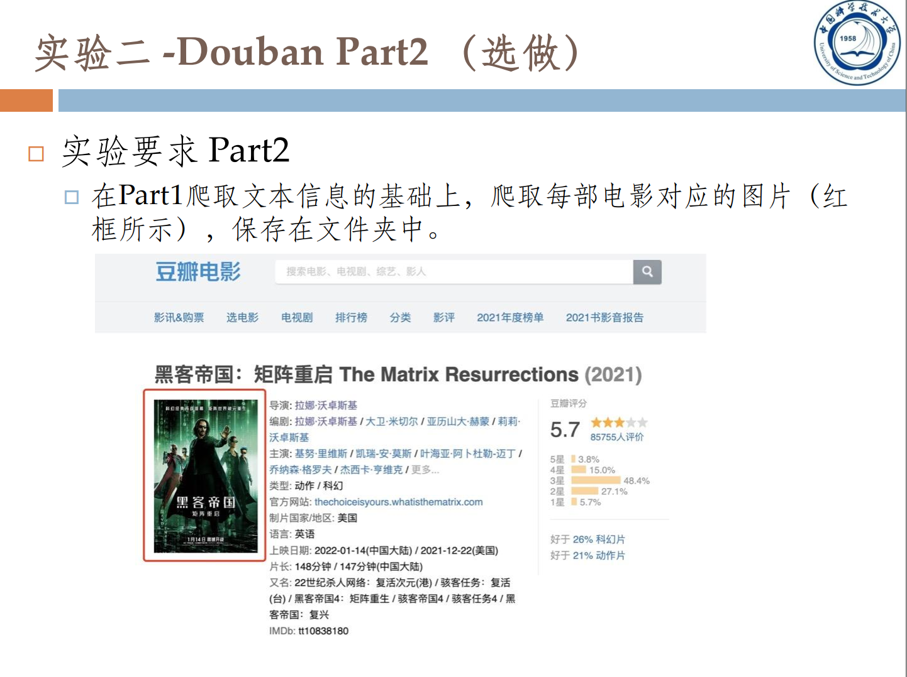
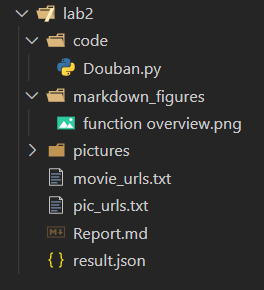
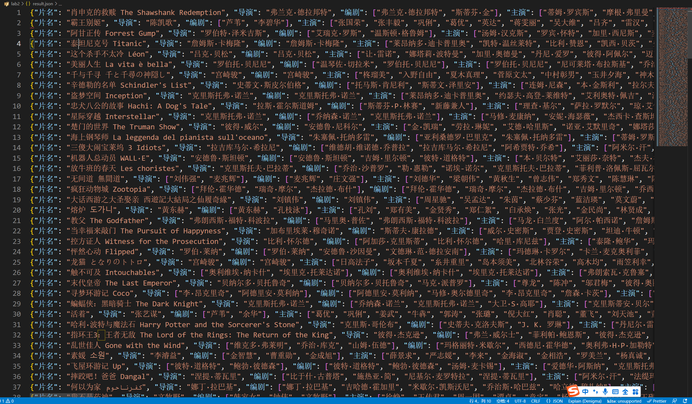
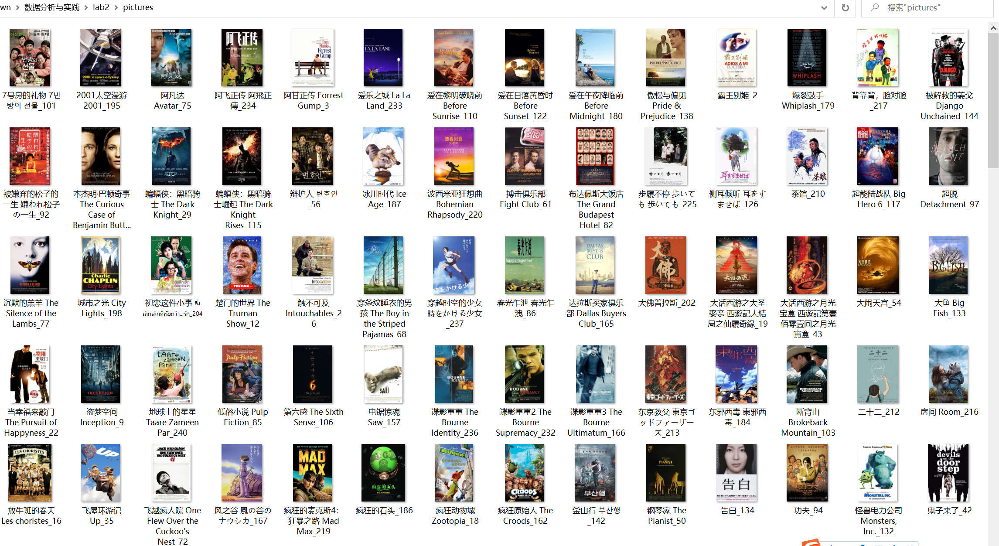

# AD2022 Lab2 Report

​													    徐海阳 PB20000326

## 一、实验要求





本人本实验选择爬取豆瓣top250的所有电影。

注：本实验认为一切信息都只能从raw_url = "www.douban.com"中获得，如：top250对应的网址，本实验认为不可以通过手动记录的方式保存在list中然后访问。必须由raw_url一步步搜索得到。

## 二、实验思路

### 2.1 文件树结构



lab2

——code

​		——Douban.py						# **爬虫源码**

——markdown_figures					# **存放实验报告中用到的图片**

——pictures									# **爬取的豆瓣top250部电影的海报**

​		——7号房的礼物 7번방의 선물_101.jpg

​		——2001太空漫游 2001_195.jpg

​		—— ...

——movie_urls.txt							# **250部电影的url（爬虫中间产品）**

——pic_urls.txt								# **250部电影海报的url（爬虫中间产品）**

——Report.md								# **实验报告的markdown源码** 

——result.json								# **250部电影内容的json文件（实验要求的result）**

——Report.pdf								# **实验报告的PDF文件**

​		

### 2.2 用到的库和作用

```python
from urllib.request import urlopen, Request, urlretrieve
from bs4 import BeautifulSoup
import os
import re
import json
import time
import pdb
```

#### urllib.request 爬虫库：

1. Request：用来访问url的爬虫代理
2. urlopen：访问url，返回页面的源代码
3. urlretrieve：用来下载url对象（电影的海报）

#### BeautifulSoup爬虫库：

解析页面源代码，用以提取想要的html对象，如url、text等

#### re库：

正则表达式，用以解析文字内容

#### json库：

将电影info从dict形式写入json文件

#### time库：

用time.sleep()防止因为访问请求过于频繁导致ip被封

#### pdb库：

调试代码


### 2.3 爬虫程序函数结构


1. `def general_url_process(url, headers):`

    用来返回url的html对象，后续用Beautifulsoup进行处理

2. `def get_toplist_url(url, headers):`

    返回“豆瓣排行榜”的url

3. `def get_top250_url(url, headers):`

    返回“豆瓣top250”的url（第一页）

4. `def get_total_pages_list(url, headers):`

    返回“豆瓣top250”的所有url（共10页，每页25条，共250条）

5. `def get_pic_and_info(list):`

    返回给定的url list中的pic url和movie url

6. `def get_each_page_pic_and_info(url, headers):`

    返回一个页面25个movie的pic url和movie url

7. `def get_all_pic_and_movie_urls(movie_path, pic_path, url, headers):`

    返回所有250部电影的pic url和movie url

8. `def read_pic_and_movie_urls(movie_path, pic_path):`

    从指定路径读取下载好的pic url movie url（避免代码调试时反复爬取，造成时间浪费）

9. `def get_each_movie_info(url, headers):`

    返回movie url对应的详细信息dict，包括片名，导演，编剧.......

10. `def save_pic(pic_url, pic_name, save_dir):`

    将250部电影的海报存入指定文件夹

11. `def save_json(path, dict):`

    将250部电影的信息dict写入指定json文件

12. `if __name__ == '__main__':`

    主函数。具体流程如下：

    douban.com 		 ->		  豆瓣排行榜.com  		-> 		豆瓣top250.com 		->			250部电影的url

    -> 		250部电影的pic_url(海报照片)和movie_url(详细信息dict)			

    ->		将pic_url对应的海报存入pic文件夹，movie_url对应的info_dict写入json

​	

### 2.4 实现细节

具体可以看代码，个人认为注释较为详细，清晰易读。

同时，做了简单的反爬(time.sleep())，也有一些防止反复爬取和写入的trick，比如只有第一次实验的时候爬取了所有250个电影的url，然后存在了movie_urls.txt和pic_urls.txt里，在后续实验的调试过程中无需再次爬取。


## 三、实验结果

### 3.1 result.txt文件和picture文件夹

实验成功

### 3.2 Example：json文件内容和picture文件夹的部分截图




