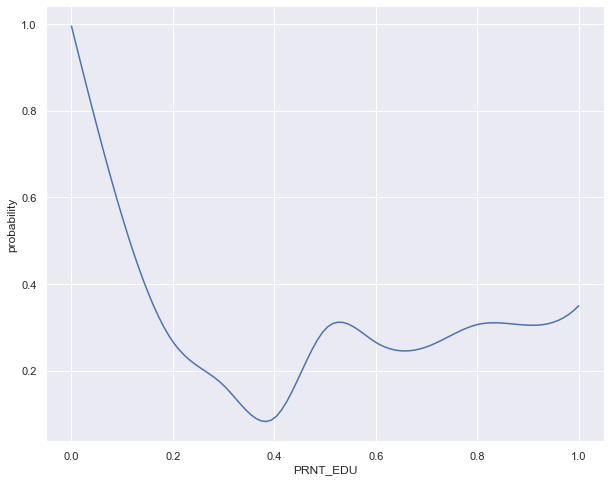

#  PISA Data Analysis

​																						徐海阳 PB20000326

## Introduction

Report for AD2022 Lab3

### Lab Requirement

<table>
    <tr>
        <td ><center> </center></td>
        <td ><center> </center></td>
    </tr>


### Result Performance Preview

<div style="width:1000px;margin:0;padding:0">
    <div style="float:left;width:450px;"></div>
    <div style="float:left;width:450px;"></div>
    <div style="clear:both"></div></div>
<div style="width:1000px;margin:0;padding:0">
    <div style="float:left;width:450px;"> 　　　　relationship between parental care and repetition</div>
    <div style="float:left;width:450px;"> 　　　　　　　　created new features heat map</div>
    <div style="clear:both"></div></div>


<div style="width:1000px;margin:0;padding:0">
    <div style="float:left;width:450px;"></div>
    <div style="float:left;width:450px;"></div>
    <div style="clear:both"></div></div>
<div style="width:1000px;margin:0;padding:0">
    <div style="float:left;width:450px;"> 　　　　relationship between knowledge richness and repetition</div>
    <div style="float:left;width:450px;"> 　　　　relationship between life quality and repetition</div>
    <div style="clear:both"></div></div>


## Approach

### Preprocess

#### **Data Cleaning**

1. Data type uniform: 

    Turn str and object to int or float. $\tag {1}$

2. Meaningless data discard: 

    Drop columns with the same data which means they are unrelated to the classification result.

3. Normalization of abnormal data:

    Pick out the data with vacant values, including the abnormal options in the questionnaire (9,99, 999, etc.)

    And fill the data with the majority of that type of feature(mode number filling).

3. Data standarlization: 

    MinMaxscaler to take all the data in [0,1].

4. Auxiliary task: 

    Construct the relationship between paraphrases and numbers in the codebook and store them in the dictionary. 

    For subsequently easy view and operation.

    

#### **Feature Classification Manually**

A number of representative feature classes were manually selected from over 400 features. The serial number represents the column number. Each feature class contains multiple columns of data.

parent education: 11~20 `PRNT_EDU`

study environment: 11 13~16 20 21 `STDY_EVNRMNT`

life quality: 12 18 19 23-26 "n" 27-35 `LF_QLTY`

parent care: 36-39 `PRNT_CR`

former repeat: 48-50 `EX_RPT`

study attitude: 52-54 55 56 57-64 `STY`

peer relationship: 73-78 `PEER`

teacher relationship: 79-84 `TCHR`

skip lesson: 90-92 `SKIP`

class phenonmenon: 116-120， 121-129，130-146 `CLS1,2,3`

knowledge: 304-403 `KNLDG`


#### **Create Tool Function**

```python
def make_df(df, index_list, add_repeat = False)
"""
Select columns from `df` according to `index_list`, return a new df. If `add_repeat` == `True`, then the df will automatically add the `REPEAT` column from the PISA data.
"""
def sum(df,name,mean = False)
"""
Calculate the sum of all features for each sample in `df` simply by add one by one, return a new_df with only one column whose name is`name`.
"""
def sum_stdlz(map, df, name)
"""
Calculate the sum of all features for each sample in `df` according to the correlation of features revealed by the heatmap `map`, return a new_df with only one column whose name is`name`.
"""
def draw_corr_map(df,method='pearson')
"""
Calculate the covariance between all the characteristic variables in `df`, get the covariance matrix, and plot the heatmap
"""
```

### Data Extraction and Rough Analysis

#### PRNT_EDU(Parent Education)

<div style="width:1000px;margin:0;padding:0">
    <div style="float:left;width:450px;"></div>
    <div style="float:left;width:450px;"></div>
    <div style="clear:both"></div></div>

<div style="width:1000px;margin:0;padding:0">
    <div style="float:left;width:450px;"></div>
    <div style="float:left;width:450px;">
        <p>The educational level of the parents was counted and a pie chart was drawn based on the results. It was found that fathers and mothers have approximately the same level of education.</p>
        <p>Therefore, a "PRNT_EDU" feature was created for each sample by assigning different weights to different education levels, and a violin plot was drawn based on the new feature, respectively for REPEAT = 0/1. </p>
        <p>
           It is somewhat counter-intuitive that we can find that the parents of repeating students are surprisingly more educated than the parents of non-repeating students. We will analyze the feature further afterwards. 
        </p>
</div>
    <div style="clear:both"></div></div>


#### **STDY_EVNRMNT(Study Environment)**

<table>
    <tr>
        <td ><center> </center></td>
    </tr>
</table>

Study environment is an indicator of the richness of electronic devices in the student learning environment. The "STDY_EVNMNT" characteristic is obtained by simply summing the contributions of various electronic devices. The frequency distribution of the feature is plotted separately for repeating or not repeating.

We can see that the richer the electronic devices, the higher the repetition rate of students. This is also in line with common sense, because with high electronic devices, students tend to be more likely to use them for things that are not related to their studies, such as playing games, chatting on social software, etc. 


#### **LF_QLTY(Life Quality)**

<div style="width:1000px;margin:0;padding:0">
    <div style="float:left;width:450px;"></div>
    <div style="float:left;width:450px;">
        <p>"Life Quality" is relatively simple to obtain: the values of the variables related to household wealth and quality of life are simply summed. Histogram of the frequency distribution for repeating or not repeating.</p>
        <br>
        <p>We don't seem to see much difference in the distribution information from this graph, which we will discuss in detail later.</p>
</div>
    <div style="clear:both"></div></div>


#### **PRNT_CR(Parent Care)**

<div style="width:1000px;margin:0;padding:0">
    <div style="float:left;width:450px;"></div>
    <div style="float:left;width:450px;"></div>
    <div style="clear:both"></div></div>

A covariance matrix is calculated and a heat map is drawn based on the characteristics that show the degree of parental concern and encouragement for the student. Sum all the care up. Then violin plots were drawn based on whether to repeat and the parental care. 
		It can be found that these characteristics are highly correlated, which is in line with common sense, since parents who encourage students to get good grades tend to comfort them when they lose as well. Also, according to the violin chart we can see that students who do not repeat tend to have more parental care compared to those who do. And it's easy to understand too.


#### **EX_RPT(Former REPEAT Record)**

<div style="width:1000px;margin:0;padding:0">
    <div style="float:left;width:450px;"></div>
    <div style="float:left;width:450px;">
        <p>Past REPEAT records. When I was manually organizing the features, I realized that this was in fact a quickpath for predicting REPEAT. Let's see the data analysis.</p>
    <p>
	Sum the three past repeat record together to form new feature "EX_RPT". Directly plot the relevance heat map based on the distribution. Good lord, the degree of correlation is almost linear! Perfect feature. </p>
    	<p>It's also understandable that a person often repeats because of various reasons, such as poor academic ability, too much negative emotion given by teachers and parents, and so on. Unless he makes changes, it is likely that he will continue to repeat.</p>
	</div>
    <div style="clear:both"></div></div>


#### STY(STY Ambition)

<div style="width:1000px;margin:0;padding:0">
    <div style="float:left;width:450px;"></div>
    <div style="float:left;width:450px;"></div>
    <div style="clear:both"></div></div>


Study ambition is certainly also an important factor influencing whether to repeat the study or not. List all the characteristics about study ambition and statistically plot the heat map. It is also weighted and normalized according to the map.

Then we draw the Histogram of the frequency distribution for repeating or not repeating. We can observe that students with lower ambition tend to have lower probability of repeating. I guess it is because of the high self-expectation, resulting in too much pressure, but not good learning.


#### **PEER(Peer Relationship)**

<div style="width:1000px;margin:0;padding:0">
    <div style="float:left;width:450px;"></div>
    <div style="float:left;width:450px;"></div>
    <div style="clear:both"></div></div>


Next is the PEER characteristic, which examines the relationship between partners. Heat maps are drawn based on statistical data and a strong correlation is found between the data. Therefore, the new feature "PEER" is obtained by fusing the features according to the map. 

It can be found that compared to the normal repetition rate of 25%, the ratio of repetition to non-repetition among students with poor interpersonal relationships is about one to two, which is greater than 25%. This indicates that students who repeat tend to have poorer interpersonal relationships. 


#### **TCHR(Teacher Review)**

<div style="width:1000px;margin:0;padding:0">
    <div style="float:left;width:450px;"></div>
    <div style="float:left;width:450px;"></div>
    <div style="clear:both"></div></div>


TCHR characteristics are characteristics made up of your teacher's attitude and evaluation of you. The higher the value, the harsher and lower the teacher's evaluation of you. Draw a heat map and a violin map. 

It can be found that students who repeat their studies tend to have a higher value of the TCHR characteristic, which indicates that the teacher's attitude and evaluation of them is worse and may even be offensive and insulting.


#### SKIP(Skip class)

<div style="width:1000px;margin:0;padding:0">
    <div style="float:left;width:450px;"></div>
    <div style="float:left;width:450px;"></div>
    <div style="clear:both"></div></div>


SKIP characteristics mainly count the frequency and duration of students' skipping classes. The higher the value indicates the more serious students' skipping classes. Draw a heat map and a violin map. 

We can find that students who repeat have a higher skipping rate, which also explains their worse academic performance in the opposite direction.


#### CLS(Class Teaching Phenomenon)

<table>
    <tr>
        <td ><center> </center></td>
        <td ><center> </center></td>
        <td ><center> </center></td>
    </tr></table>

The CLS features counted a large number of data on classroom atmosphere and teachers' teaching ability, etc. We obtained CLS1, CLS2, and CLS3 features by summing up, which represent classroom teaching atmosphere, teacher's teaching ability, and course scheduling rationality, respectively. Frequency histograms of CLS1,2 and heat maps of CLS3 were drawn.

We can find that these manually selected features do possess an extremely strong correlation and can be divided into groups. 


#### KNLDG(Knowledge)

<div style="width:1000px;margin:0;padding:0">
    <div style="float:left;width:450px;"></div>
    <div style="float:left;width:450px;"></div>
    <div style="clear:both"></div></div>


The Knowledge feature is also a quantity that I am sure must be highly correlated with REPEAT after constructing it.

Knowledge is a feature consisting of 100 academic test scores in a variety of scientific disciplines. Plotting frequency histograms and violin plots, we can see that students who do not repeat have a much higher level of knowledge compared to those who do. Perfect feature! 


## Further Analysis

Integrate all self-constructed features into a Dataframe. Count the covariance matrix and plot the heat map.

<div style="width:1000px;margin:0;padding:0">
    <div style="float:left;width:500px;"></div>
    <div style="float:left;width:400px;">
        <p>We can see that the features in DIY_df has slightly connection, besides (KNLDG,EX_RPT) and (CLS1,CLS2,CLS3).</p>
        <br>
    <p>
	It's easy to understand. If you have poorer knowledge, then you are more likely to repeat your in the past. CLS1,2,3 reveals different parts in school classes, thus they are have strong connection. </p>
        <br>
    	<p>Next, let's see the relationship between some features and the target `REPEAT`</p>
	</div>
    <div style="clear:both"></div></div>

The data were discretized and the ratio between the number of newly increased repeaters in each small interval and the total number of repeaters and non-repeaters in that interval was counted, which is the repeater rate in that small interval, and from that the relationship curve between the repeater rate and the characteristic take values was drawn. Smoothing was performed with quadratic interpolation.

<div style="width:1000px;margin:0;padding:0">
    <div style="float:left;width:500px;"></div>
    <div style="float:left;width:400px;">
        <p>First, the relationship between parents' education level and repetition rate is observed. It can be seen that children's repetition rate is lowest when parents' education level is around 0.4. Too little parental education leads to a significantly higher repetition rate than for those with relatively more educated parents, while parental education starts to affect the repetition rate less from about 0.5 and the curve starts to fluctuate.</p>
        <p>
            A wild guess is that parents with too little education will cause their children to grow up without much interest in learning or being able to supervise them. And after the parents' education level reaches a certain value, the level of attention to their children's learning will be about the same, and the impact will not be reflected in the repetition rate.
        </p>
	</div>
    <div style="clear:both"></div></div>


<div style="width:1000px;margin:0;padding:0">
    <div style="float:left;width:500px;"></div>
    <div style="float:left;width:400px;">
        <p>Next is the relationship between the quality of life level and the repetition rate. It can be significantly seen that the quality of life has the lowest repetition rate around 0.6. The repetition rate rises significantly at both ends of the spectrum.</p>
        <br>
    <p>
	It is well understood that if the quality of life is too low, students can hardly have the same study conditions to study; while if the quality of life is too high, students do not have the mind to study well, they don't have life pressure.</p>
        <br>
    	<p>As a result, it is often the middle class students who will study hard, seeking to make the class leap and realize their own life values.</p>
	</div>
    <div style="clear:both"></div></div>


<div style="width:1000px;margin:0;padding:0">
    <div style="float:left;width:500px;"></div>
    <div style="float:left;width:400px;">
        <p>Next is the relationship between parental care and repetition rates. We can see that the repetition rate is highest when parental care is at 0.2. As parental care continues to increase, the repetition rate decreases significantly.</p>
        <br>
    <p>
	This is understandable. This is because the more encouragement and comfort from parents, the more the students' academic confidence grows and the relative stress is certainly not as great as that of students who are scolded by their parents every day.</p>
        <br>
    	<p>The reason why the repetition rate is slightly lower in places where parental care is close to 0 is, I think, probably because these students are self-motivated and indefatigable.</p>
	</div>
    <div style="clear:both"></div></div>

<div style="width:1000px;margin:0;padding:0">
    <div style="float:left;width:500px;"></div>
    <div style="float:left;width:400px;">
        <p>Next, we analyze the relationship between the skipping rate and the repeating rate. The repetition rate increases as the truancy rate increases, peaking at about 0.9.</p>
        <br>
    <p>
	This is easy to understand because the more you skip classes, the more likely it is that you are not learning enough. Therefore the repetition rate increases.</p>
        <br>
    	<p>The reason why repetition rate decreases after 0.9, I think, is that some gifted students do not need the guidance of teachers, so the more they skip class, the more their academic performance goes up.</p>
	</div>
    <div style="clear:both"></div></div>


<div style="width:1000px;margin:0;padding:0">
    <div style="float:left;width:500px;"></div>
    <div style="float:left;width:400px;">
        <p>Next, we analyze the relationship between teachers' evaluations and students' repetition rates. </p>
        <br>
    <p>
	It can be seen that the harsher the teacher and the lower the evaluation of the student, the higher the repetition rate keeps rising.</p>
        <br>
    	<p>This is an interactive process. Students often repeat because of poor academic performance, and teachers tend to look down on them or even insult them, which may further increase students' aversion to school and lead to a further decline in academic performance. A vicious circle.</p>
	</div>
    <div style="clear:both"></div></div>


<div style="width:1000px;margin:0;padding:0">
    <div style="float:left;width:500px;"></div>
    <div style="float:left;width:400px;">
        <p>Finally, there is the relationship between the student's knowledge base and the repetition rate. This is one of the clearest relationships. </p>
        <br>
    	<p>The richer the knowledge base, the better the student's academic performance, and the less likely he or she is to repeat.</p>
	</div>
    <div style="clear:both"></div></div>


## Supplementary

### Environment and Packages

```python
import pandas as pd
import matplotlib
import matplotlib.pyplot as plt
import seaborn as sns
import numpy as np
import json
from sklearn.preprocessing import StandardScaler
from sklearn.preprocessing import MinMaxScaler
from scipy import interpolate
%matplotlib inline
```

vscode

jupyter notebook

anaconda

### Knowledge Covered

Data Preprocess : 

	1. Data Cleaning
	1. Data Integration
	1. Data Transformation
	1. Data Statute

Feature Engineering  :

 	1. Feature Extraction
 	2. Feature Design
 	3. Feature Construction

Covers Prof. QiLiu's AD2022 PPT slides Chapter2 :`Data Preprocess`and`Feature Engineer`.


## Conclusion

Lab3 spend me much more than 8h... About 3*8h... Sigh...

But I have learned a lot:

 	1. Feature Engineering
 	2. Convenience of Jupyter for showing and plotting
 	3. Seaborn Plotting of different kinds of excellent figures
 	4. CSS style design for prettier Markdown PDF 

Tired, but Happy for AD lab! 


